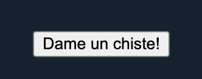
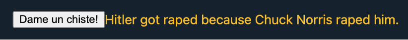

# Promesas en JavaScript

## 1. Objetivo
En este ejercicio trataremos de aunar algunos de los conceptos que hemos ido trabajando en los tres primeros temas de la asignatura.
Concretamente:
 - Crearemos un archivo HTML index.html que contendrá, como mínimo, un botón con el texto "Dame un chiste" que, cada vez que se presione, realizará una llamada contra la [API de chistes aleatorios de Chuck Norris](https://api.chucknorris.io/) y volcará el chiste recibido en un párrafo ``
`` del documento HTML. 
 - El script para realizar esta acción estará dentro del propio archivo HTML.
 - Eventos de JavaScript.
 - Crearemos un archivo CSS styles.css que contendrá cualquier estilo que queramos aplicar al documento HTML.

## 2. Instrucciones
La petición asíncrona que debe realizarse para obtener los datos del chiste debe realizarse mediante Fetch API, tal y como vimos en el ejemplo de clase.
No obstante, podéis obtener más información de esta API [aquí](https://developer.mozilla.org/en-US/docs/Web/API/Fetch_API).

Se recomienda también leer la [documentación sobre Response](https://developer.mozilla.org/en-US/docs/Web/API/Response/json), el objeto que recibimos tras utilizar fetch, para averiguar cómo obtener el JSON de la respuesta recibida.
La función JS resultante puede codificarse de la forma que más te guste (mediante la palabra reservada function o como una lambda/flecha).
Será necesario encadenar promesas para obtener el resultado deseado en el párrafo de nuestro documento HTML.

Por último, para actualizar de forma dinámica el contenido del párrafo, sin necesidad de recargar la página web ([AJAX](https://developer.mozilla.org/es/docs/Web/Guide/AJAX)) haremos uso del método [getElementById](https://developer.mozilla.org/es/docs/Web/API/Document/getElementById) del objeto ``document`` (el cuál estudiaremos en el siguiente tema), por lo que será necesario dotar de un ``id`` al párrafo cuyo valor queramos modificar.
Recuerda que el contenido HTML de un elemento es accesible a través de la propiedad [innerHtml](https://developer.mozilla.org/en-US/docs/Web/API/Element/innerHTML).

Debes consultar la [documentación sobre el evento “onClick”](https://www.w3schools.com/jsref/event_onclick.asp) para realizar este ejercicio.

## 3. Ejemplo de resultado
**Estado inicial del boton y parrafo:**

**Hacemos click en el boton 1 vez:**

**Hacemos click en el boton otra vez y sucesivas...:**

