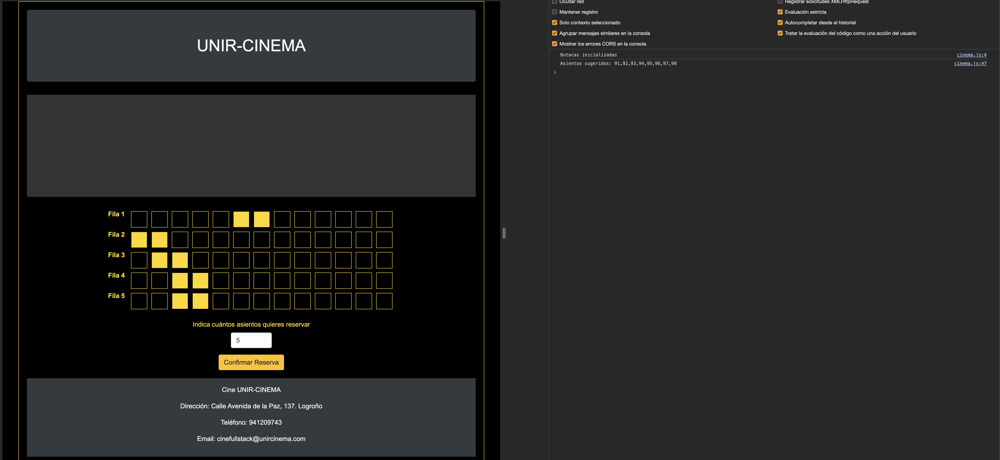
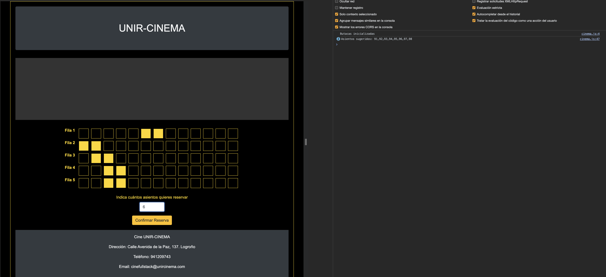

# Integración de HTML, CSS y JS

## 1. Objetivo
En este caso vamos a "enganchar" el fichero HTML que definía nuestra sala del cine con el Script que desarrollamos en el tema 2.
Dependiendo de cada implementación, es posible que haya que hacer cambios en uno o en ambos ficheros.

En el próximo tema veremos cómo hacer esto mismo de una forma más elegante que no implique alterar el código HTML.

## 2. Instrucciones
El objetivo es que cuando se introduzca un nuevo número de butacas a reservar se muestre **en la consola del navegador** el resultado de ejecutar la función ``suggest`` que ya programamos, **asumiendo que la sala está totalmente vacía**. Siempre deberían aparecer en el Set resultado las butacas de la última fila, o vacío.

Para ello, debemos:
- En el fichero ``index.html`` que desarrollamos en el tema 1, incluir la referencia al script ``cinema.js`` que desarrollamos en el tema 2. ¿Es la presencia  de este script crítica para la carga de la página? ¿Debe estar dentro de ``head`` o al final de ``body``?
- Debes hacer una llamada a la función **únicamente a modo de prueba**, por ejemplo, ``suggest(8)`` desde el HTML. La propia función debe tener un log que muestre el Set que se está devolviendo antes de terminar su ejecución. En el próximo tema haremos que esta llamada use un parámetro dinámico. Por ahora la invocación quedará fija.
- La función debe ejecutarse cuando el contenido del ``input`` cambie. Para ello, debes usar:
    - El evento ``onInput`` del ``input`` en el archivo HTML. [Aquí tienes más información sobre este evento.](https://www.w3schools.com/jsref/event_oninput.asp) Si bien podrían haberse usado otros eventos como ``onChange``, en este caso este evento es el más adecuado. Puedes probar las diferencias entre ambos si quieres.

En el siguiente tema veremos también herramientas para cambiar el estilo visual de las butacas una vez hayan sido seleccionadas.

## 3. Ejemplo de resultado

(Ten en cuenta que los resultados que se muestran en la consola en estos ejemplos corresponden a una matriz de 10x10, tal como se daba en el código de apoyo del Tema 2. Lo que se busca es ver que la conexión entre el archivo HTML y el JS funciona correctamente).

**Estado inicial:**

**Cambiamos contenido del input 1 vez:**

**Cambiamos contenido del input otra vez y sucesivas... :**

